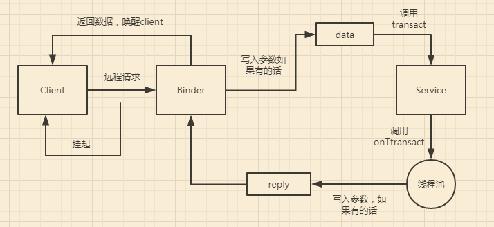

# Android跨进程通信总结
### 前言：

很多时候我们在写demo的时候会觉得很烦,主要是关于view绑定的(又懒得在demo中集成ButterKnife),我提供一下我的方法。

#### 1.<a href = "https://github.com/laobie/FindViewByMe">findviewbyme插件</a>

一款自动帮你集成findViewById的插件,非常好用。但是这款插件并没有像ButterKnife一样提供点击事件的绑定,所以有点遗憾。那么我的方法不得不进行第二步,因为我感觉每次写绑定事件都很烦！

#### 2.给view设置点击监听

其实是一个方法：

```
private void initListener(View... views)
{
    for (View view : views)
    {
        view.setOnClickListener(this);
    }
}
```

然后现在代码是这样的：

```
private void initView()
{
    mMessengerBtn = (Button) findViewById(R.id.messenger_btn);
    mAidlBtn = (Button) findViewById(R.id.aidl_btn);
    initListener(mAidlBtn, mMessengerBtn);
}

private void initListener(View... views)
{
    for (View view : views)
    {
        view.setOnClickListener(this);
    }
}
```

但是可以注意到initListener方法是固定不变的,所以可以使用Android Studio提供的模板来提高效率。

模板如下：


定义好模板好,我们就可以这样：


这样可以快速生成此方法。然后接下来你肯定也想到了onClick方法也可以用模板。

#### 3.view点击回调onClick()方法

模板如下：


定义好模板,使用如下：


**这样利用插件和模板就可以快速生成令人讨厌的findviewById和点击监听。**


### IPC基础概念(正文内容全部来自艺术探索书籍)

**只有使用Serializable和Parcelable接口完成对象的序列化才能完成Intent和Binder传输数据或者把对象持久化到存储设备上或者通过网络传输给其他客户端。**

#### 1.Serializable接口

**常规的我就不谈了，贴下代码。**

```
public class User implements Serializable
{
    public static final long serialVersionUID = 234234325L;

    public int userId;
    public String userName;
    public boolean isMale;

    public User(int userId, String userName, boolean isMale)
    {
        this.userId = userId;
        this.userName = userName;
        this.isMale = isMale;
    }
}
```

```
private void serialization() throws IOException, ClassNotFoundException
{
    //序列化过程
    User user = new User(0, "xiaokun", true);
    FileOutputStream fileOutputStream = new FileOutputStream("cache.txt");
    ObjectOutputStream out = new ObjectOutputStream(fileOutputStream);
    out.writeObject(user);
    out.close();

    //反序列化过程
    ObjectInputStream in = new ObjectInputStream(new FileInputStream("cache.txt"));
    User newUser = (User) in.readObject();
    in.close();
}
```

有一个需要注意，需要声明一个serialVersionUID，如下所示

`private static final long serialVersionUID = 22324323423L;`

实际上，甚至这个serialVersionUID也不是必需的，不声明这个serialVersionUID同样也可以实现序列化，但是这将对反序列化过程产生影响。这个serialVersionUID是用来辅助序列化和反序列化过程的，原则上序列化后的数据中的serialVersionUID只有和当前类的serialVersionUID相同才能够正常地被反序列化。serialVersionUID的工作机制：序列化的时候系统会把当前类的serialVersionUID写入序列化的文件中，当反序列化的时候系统会去检测文件中的serialVersionUID，看它是否和当前类的serialVersionUID一致，如果一致说明序列化的类的版本和当前类的版本是相同的，这个时候可以成功反序列化；否则就说明当前类和序列化的类相比发生了某些变换，比如成员变量的数量/类型可能发生了改变，这个时候是无法正常反序列化的。

如果手动指定serialVersionUID的值，这样序列化和反序列化时两者是相同的，因此可以正常反序列化。

如果不手动指定serialVersionUID，那么系统会根据根据当前类的结构自动去生成它的hash值并赋值给serialVersionUID。有两种可能，一是当前类没有改变，那么可以反序列化成功；二是当前类有所改变，比如增加或者删除了某些成员变量，那么系统就会重新计算当前类的hash值并把它赋值给serialVersionUID，这个时候当前类的serialVersionUID就和序列化的serialVersionUID不一致，于是反序列化失败，程序就会出现crash。所以手动指定了serialVersionUID后，就可以在很大程度上避免反序列化过程的失败。比如当版本升级后，我们可能删除了某个成员变量也可能增加了一些新的成员变量，这个时候我们的反向序列化过程仍然能够成功，程序仍然能够最大限度地恢复数据，否则就会crash。**如果类结构发生了非常规性改变，比如修改了类名，修改了成员变量地类型，这个时候尽管serialVersionUID验证通过了，但是反序列化过程还是会失败，因为类结构有了毁灭性地改变。**

#### 2.Parcelable接口

不多谈了，就推荐一个Parcelable插件(谷歌一搜就出来了)，完事了。

Parcelable是Android中的序列化方式，以前还说使用稍显麻烦，但是自动有了Parcelable插件就不存在了，推荐首选；Serializable是java中的序列化方式，使用起来极其简单但是开销很大，序列化和反序列化过程需要大量I/O操作。

#### 3.Binder

因为我是做Android应用层开发，所以主要是说Binder在应用层开发的作用。从Android应用层来说，Binder是客户端和服务端通信的媒介，当bindService的时候，服务端会返回一个包含了服务端业务调用的Binder对象，通过这个Binder对象，客户端就可以获取服务端提供的服务或者数据，这里的服务包括普通服务和基于AIDL的服务。Android开发中，Binder主要用在Service中，包括AIDL和Messenger，其中普通的Service中的Binder不涉及进程间通信，无法触及Binder的核心，而Messenger的底层其实是AIDL。**AIDL是什么？AIDL是Android Interface definition language的缩写，它是一种Android内部进程通信接口的描述语言，通过它我们可以定义进程间的通信接口。在Android应用开发中AIDL主要解决的问题有：①实现多个应用共享同一个Service的功能，比如IM服务可以提供给多个APP使用，比如现在的推送；②可以跨进程通信或者跨进程调用服务中的方法；**

```
public static abstract class Stub extends android.os.Binder implements com.xiaokun.aidldemo.IBookManager
{
    /**
     * Binder的唯一标识，一般用当前Binder的类名表示
     */
    private static final java.lang.String DESCRIPTOR = "com.xiaokun.aidldemo.IBookManager";

    /**
     * Construct the stub at attach it to the interface.
     */
    public Stub()
    {
        this.attachInterface(this, DESCRIPTOR);
    }

    /**
     * 用于将服务端的Binder对象转换成客户端所需的AIDL接口类型的对象，这种转换过程是区分进程的，
     * 如果客户端和服务端位于同一进程，那么此方法返回的就是服务端的Stub对象本身,否则返回的是系统封装后的
     * Stub.proxy对象
     */
    public static com.xiaokun.aidldemo.IBookManager asInterface(android.os.IBinder obj)
    {
        if ((obj == null))
        {
            return null;
        }
        android.os.IInterface iin = obj.queryLocalInterface(DESCRIPTOR);
        if (((iin != null) && (iin instanceof com.xiaokun.aidldemo.IBookManager)))
        {
            return ((com.xiaokun.aidldemo.IBookManager) iin);
        }
        return new com.xiaokun.aidldemo.IBookManager.Stub.Proxy(obj);
    }

    /**
     * 返回当前Binder对象
     *
     * @return
     */
    @Override
    public android.os.IBinder asBinder()
    {
        return this;
    }

    /**
     * 这个方法运行在服务端中的Binder线程池中，当客户端发起跨进程请求时，远程请求会通过
     * 系统底层封装后交由此方法来处理。服务端通过code可以确定客户端所请求的目标方法是什么，
     * 接着从data中取出目标方法所需的参数（如果目标方法有参数的话），然后执行目标方法。当
     * 目标方法执行完毕后，就向reply中写入返回值（如果目标方法有返回值的话）。需要注意的是
     * 如果此方法返回false,那么客户端的请求会失败，因此我们可以利用这个特性做权限验证。
     *
     * @param code
     * @param data
     * @param reply
     * @param flags
     * @return
     * @throws android.os.RemoteException
     */
    @Override
    public boolean onTransact(int code, android.os.Parcel data, android.os.Parcel reply, int flags) throws android.os.RemoteException
    {
        switch (code)
        {
            case INTERFACE_TRANSACTION:
            {
                reply.writeString(DESCRIPTOR);
                return true;
            }
            case TRANSACTION_getBookList:
            {
                data.enforceInterface(DESCRIPTOR);
                java.util.List<com.xiaokun.aidldemo.Book> _result = this.getBookList();
                reply.writeNoException();
                reply.writeTypedList(_result);
                return true;
            }
            case TRANSACTION_addBook:
            {
                data.enforceInterface(DESCRIPTOR);
                com.xiaokun.aidldemo.Book _arg0;
                if ((0 != data.readInt()))
                {
                    _arg0 = com.xiaokun.aidldemo.Book.CREATOR.createFromParcel(data);
                } else
                {
                    _arg0 = null;
                }
                this.addBook(_arg0);
                reply.writeNoException();
                return true;
            }
            case TRANSACTION_registerListener:
            {
                data.enforceInterface(DESCRIPTOR);
                com.xiaokun.aidldemo.IOnNewBookArrivedListener _arg0;
                _arg0 = com.xiaokun.aidldemo.IOnNewBookArrivedListener.Stub.asInterface(data.readStrongBinder());
                this.registerListener(_arg0);
                reply.writeNoException();
                return true;
            }
            case TRANSACTION_unRegisterListener:
            {
                data.enforceInterface(DESCRIPTOR);
                com.xiaokun.aidldemo.IOnNewBookArrivedListener _arg0;
                _arg0 = com.xiaokun.aidldemo.IOnNewBookArrivedListener.Stub.asInterface(data.readStrongBinder());
                this.unRegisterListener(_arg0);
                reply.writeNoException();
                return true;
            }
            case TRANSACTION_add:
            {
                data.enforceInterface(DESCRIPTOR);
                int _arg0;
                _arg0 = data.readInt();
                int _arg1;
                _arg1 = data.readInt();
                this.add(_arg0, _arg1);
                reply.writeNoException();
                return true;
            }
        }
        return super.onTransact(code, data, reply, flags);
    }

    private static class Proxy implements com.xiaokun.aidldemo.IBookManager
    {
        private android.os.IBinder mRemote;

        Proxy(android.os.IBinder remote)
        {
            mRemote = remote;
        }

        @Override
        public android.os.IBinder asBinder()
        {
            return mRemote;
        }

        public java.lang.String getInterfaceDescriptor()
        {
            return DESCRIPTOR;
        }

        /**
         * 这个方法运行在客户端，当客户端远程调用此方法时，它的内部实现如下：首先创建该方法所需要的输入性Parcel对象_data、
         * 输出型Parcel对象_reply和返回值对象List；然后把该方法的参数信息写入_data中（如果有参数的话）；接着transact方法
         * 来发起RPC（远程过程调用）请求，同时当前线程挂起；然后服务端的onTransact方法会被调用，知道RPC过程返回后，当前线程
         * 继续执行，并从_reply中取出RPC过程的返回结果；最后返回_reply中的数据。
         *
         * @return
         * @throws android.os.RemoteException
         */
        @Override
        public java.util.List<com.xiaokun.aidldemo.Book> getBookList() throws android.os.RemoteException
        {
            android.os.Parcel _data = android.os.Parcel.obtain();
            android.os.Parcel _reply = android.os.Parcel.obtain();
            java.util.List<com.xiaokun.aidldemo.Book> _result;
            try
            {
                _data.writeInterfaceToken(DESCRIPTOR);
                mRemote.transact(Stub.TRANSACTION_getBookList, _data, _reply, 0);
                _reply.readException();
                _result = _reply.createTypedArrayList(com.xiaokun.aidldemo.Book.CREATOR);
            } finally
            {
                _reply.recycle();
                _data.recycle();
            }
            return _result;
        }

        /**
         * 同上
         *
         * @param book
         * @throws android.os.RemoteException
         */
        @Override
        public void addBook(com.xiaokun.aidldemo.Book book) throws android.os.RemoteException
        {
            android.os.Parcel _data = android.os.Parcel.obtain();
            android.os.Parcel _reply = android.os.Parcel.obtain();
            try
            {
                _data.writeInterfaceToken(DESCRIPTOR);
                if ((book != null))
                {
                    _data.writeInt(1);
                    book.writeToParcel(_data, 0);
                } else
                {
                    _data.writeInt(0);
                }
                mRemote.transact(Stub.TRANSACTION_addBook, _data, _reply, 0);
                _reply.readException();
            } finally
            {
                _reply.recycle();
                _data.recycle();
            }
        }

        @Override
        public void registerListener(com.xiaokun.aidldemo.IOnNewBookArrivedListener listner) throws android.os.RemoteException
        {
            android.os.Parcel _data = android.os.Parcel.obtain();
            android.os.Parcel _reply = android.os.Parcel.obtain();
            try
            {
                _data.writeInterfaceToken(DESCRIPTOR);
                _data.writeStrongBinder((((listner != null)) ? (listner.asBinder()) : (null)));
                mRemote.transact(Stub.TRANSACTION_registerListener, _data, _reply, 0);
                _reply.readException();
            } finally
            {
                _reply.recycle();
                _data.recycle();
            }
        }

        @Override
        public void unRegisterListener(com.xiaokun.aidldemo.IOnNewBookArrivedListener listener) throws android.os.RemoteException
        {
            android.os.Parcel _data = android.os.Parcel.obtain();
            android.os.Parcel _reply = android.os.Parcel.obtain();
            try
            {
                _data.writeInterfaceToken(DESCRIPTOR);
                _data.writeStrongBinder((((listener != null)) ? (listener.asBinder()) : (null)));
                mRemote.transact(Stub.TRANSACTION_unRegisterListener, _data, _reply, 0);
                _reply.readException();
            } finally
            {
                _reply.recycle();
                _data.recycle();
            }
        }

        @Override
        public void add(int a, int b) throws android.os.RemoteException
        {
            android.os.Parcel _data = android.os.Parcel.obtain();
            android.os.Parcel _reply = android.os.Parcel.obtain();
            try
            {
                _data.writeInterfaceToken(DESCRIPTOR);
                _data.writeInt(a);
                _data.writeInt(b);
                mRemote.transact(Stub.TRANSACTION_add, _data, _reply, 0);
                _reply.readException();
            } finally
            {
                _reply.recycle();
                _data.recycle();
            }
        }
    }

    static final int TRANSACTION_getBookList = (android.os.IBinder.FIRST_CALL_TRANSACTION + 0);
    static final int TRANSACTION_addBook = (android.os.IBinder.FIRST_CALL_TRANSACTION + 1);
    static final int TRANSACTION_registerListener = (android.os.IBinder.FIRST_CALL_TRANSACTION + 2);
    static final int TRANSACTION_unRegisterListener = (android.os.IBinder.FIRST_CALL_TRANSACTION + 3);
    static final int TRANSACTION_add = (android.os.IBinder.FIRST_CALL_TRANSACTION + 4);
}
```

还是有两点需要注意：首先当客户端发起远程请求时，由于当前线程会被挂起直至服务端进程返回数据，所以如果一个远程方法是很耗时的，那么不能在UI线程中发起此请求；其次，由于服务端的Binder方法运行在Binder的线程池中，所以Binder方法不管是否耗时都应该采用同步的方式去实现，因为它已经在一个子线程中了！下面是Binder执行图：




### Android中的IPC方式

#### 1.Bundle

不多说,这是基本intent在组件间(Activity/Service/BroadcastReceiver)传递Bundle。要注意的是我们传输的数据必须能够被序列化。

#### 2.文件共享

#### 3.Messenger

#### 4.AIDL


#### 5.ContentProvider