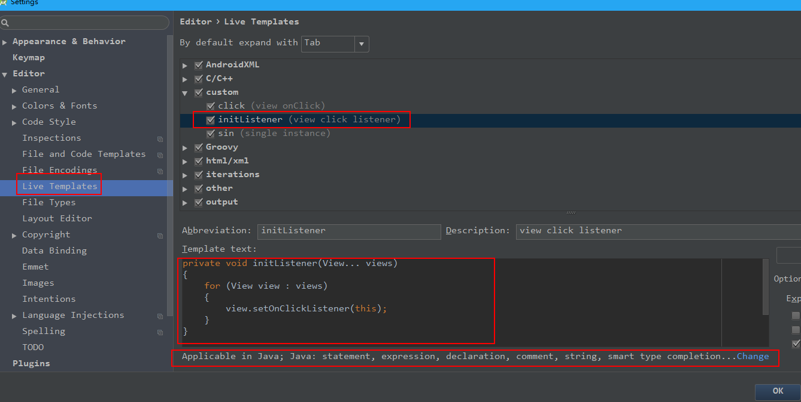
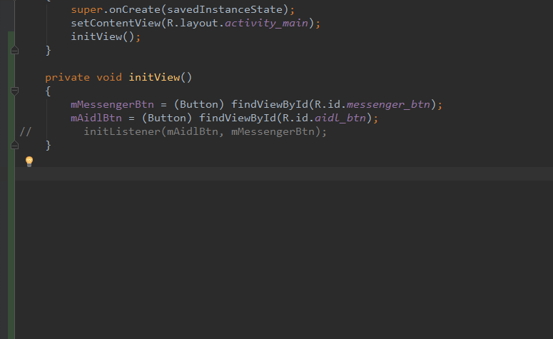
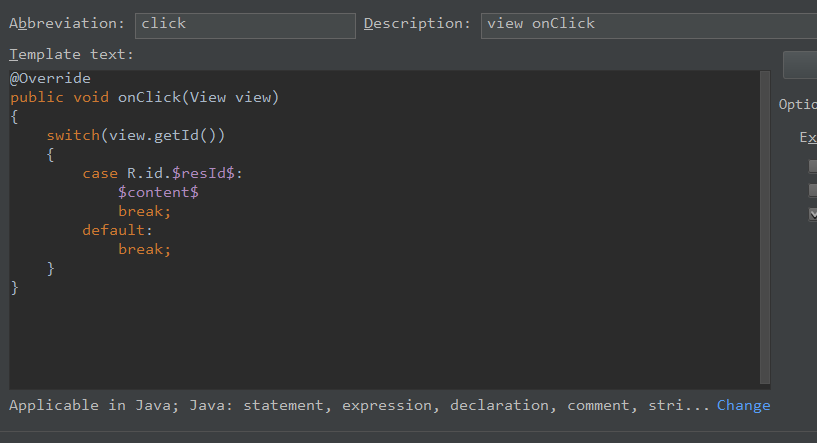
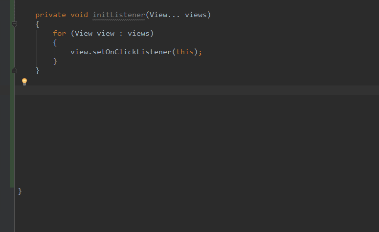

# Android跨进程通信总结
### 前言：

很多时候我们在写demo的时候会觉得很烦,主要是关于view绑定的(又懒得在demo中集成ButterKnife),我提供一下我的方法。

**1.<a href = "https://github.com/laobie/FindViewByMe">findviewbyme插件</a>**

一款自动帮你集成findViewById的插件,非常好用。但是这款插件并没有像ButterKnife一样提供点击事件的绑定,所以有点遗憾。那么我的方法不得不进行第二步,因为我感觉每次写绑定事件都很烦！

**2.给view设置点击监听**

其实是一个方法：

```
private void initListener(View... views)
{
    for (View view : views)
    {
        view.setOnClickListener(this);
    }
}
```

然后现在代码是这样的：

```
private void initView()
{
    mMessengerBtn = (Button) findViewById(R.id.messenger_btn);
    mAidlBtn = (Button) findViewById(R.id.aidl_btn);
    initListener(mAidlBtn, mMessengerBtn);
}

private void initListener(View... views)
{
    for (View view : views)
    {
        view.setOnClickListener(this);
    }
}
```

但是可以注意到initListener方法是固定不变的,所以可以使用Android Studio提供的模板来提高效率。

模板如下：



定义好模板好,我们就可以这样：



这样可以快速生成此方法。然后接下来你肯定也想到了onClick方法也可以用模板。

**3.view点击回调onClick()方法**

模板如下：



定义好模板,使用如下：



**这样利用插件和模板就可以快速生成令人讨厌的findviewById和点击监听。**


### IPC基础概念(正文内容全部来自艺术探索书籍)

**只有使用Serializable和Parcelable接口完成对象的序列化才能完成Intent和Binder传输数据或者把对象持久化到存储设备上或者通过网络传输给其他客户端。**

#### **1.Serializable接口**

**常规的我就不谈了，贴下代码。**

```
public class User implements Serializable
{
    public static final long serialVersionUID = 234234325L;

    public int userId;
    public String userName;
    public boolean isMale;

    public User(int userId, String userName, boolean isMale)
    {
        this.userId = userId;
        this.userName = userName;
        this.isMale = isMale;
    }
}
```

```
private void serialization() throws IOException, ClassNotFoundException
{
    //序列化过程
    User user = new User(0, "xiaokun", true);
    FileOutputStream fileOutputStream = new FileOutputStream("cache.txt");
    ObjectOutputStream out = new ObjectOutputStream(fileOutputStream);
    out.writeObject(user);
    out.close();

    //反序列化过程
    ObjectInputStream in = new ObjectInputStream(new FileInputStream("cache.txt"));
    User newUser = (User) in.readObject();
    in.close();
}
```

有一个需要注意，需要声明一个serialVersionUID，如下所示

`private static final long serialVersionUID = 22324323423L;`

实际上，甚至这个serialVersionUID也不是必需的，不声明这个serialVersionUID同样也可以实现序列化，但是这将对反序列化过程产生影响。这个serialVersionUID是用来辅助序列化和反序列化过程的，原则上序列化后的数据中的serialVersionUID只有和当前类的serialVersionUID相同才能够正常地被反序列化。serialVersionUID的工作机制：序列化的时候系统会把当前类的serialVersionUID写入序列化的文件中，当反序列化的时候系统会去检测文件中的serialVersionUID，看它是否和当前类的serialVersionUID一致，如果一致说明序列化的类的版本和当前类的版本是相同的，这个时候可以成功反序列化；否则就说明当前类和序列化的类相比发生了某些变换，比如成员变量的数量/类型可能发生了改变，这个时候是无法正常反序列化的。

如果手动指定serialVersionUID的值，这样序列化和反序列化时两者是相同的，因此可以正常反序列化。

如果不手动指定serialVersionUID，那么系统会根据根据当前类的结构自动去生成它的hash值并赋值给serialVersionUID。有两种可能，一是当前类没有改变，那么可以反序列化成功；二是当前类有所改变，比如增加或者删除了某些成员变量，那么系统就会重新计算当前类的hash值并把它赋值给serialVersionUID，这个时候当前类的serialVersionUID就和序列化的serialVersionUID不一致，于是反序列化失败，程序就会出现crash。所以手动指定了serialVersionUID后，就可以在很大程度上避免反序列化过程的失败。比如当版本升级后，我们可能删除了某个成员变量也可能增加了一些新的成员变量，这个时候我们的反向序列化过程仍然能够成功，程序仍然能够最大限度地恢复数据，否则就会crash。**如果类结构发生了非常规性改变，比如修改了类名，修改了成员变量地类型，这个时候尽管serialVersionUID验证通过了，但是反序列化过程还是会失败，因为类结构有了毁灭性地改变。**


### Android中的IPC方式

#### **1.Bundle**

不多说,这是基本intent在组件间(Activity/Service/BroadcastReceiver)传递Bundle。要注意的是我们传输的数据必须能够被序列化。

#### **2.文件共享**

#### **3.Messenger**

#### **4.AIDL**

#### 5.ContentProvider